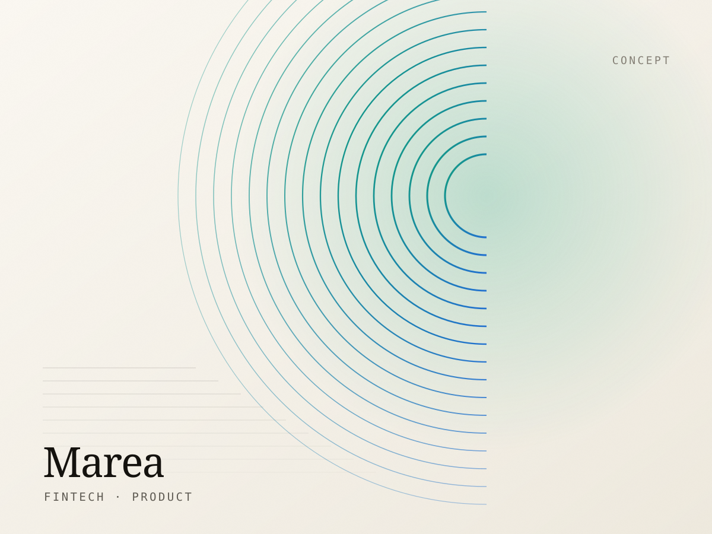

# WebDesignerPR

A custom website for **webdesignerpr.com** — an independent web design and
development studio. Hand-written HTML5, CSS3 and vanilla JavaScript with GSAP
for motion. No framework, no build step, no dependencies to install.

**Bilingual** — Spanish at the root, English in `/en/`.
**Two themes** — light by default, dark on a toggle that remembers the choice.

Open `index.html` in a browser and it runs.

---

## Contents

1. [Creative direction](#creative-direction)
2. [Pages and languages](#pages-and-languages)
3. [Folder structure](#folder-structure)
4. [Running it locally](#running-it-locally)
5. [Deployment](#deployment)
6. [Themes — how light and dark work](#themes--how-light-and-dark-work)
7. [Changing the colours](#changing-the-colours)
8. [Changing the typography](#changing-the-typography)
9. [Editing the copy](#editing-the-copy)
10. [Adding or removing a language](#adding-or-removing-a-language)
11. [Replacing the images](#replacing-the-images)
12. [Connecting the contact form](#connecting-the-contact-form)
13. [Content you must replace before launch](#content-you-must-replace-before-launch)
14. [How the animation layer works](#how-the-animation-layer-works)
15. [Accessibility](#accessibility)
16. [Performance notes](#performance-notes)
17. [Browser support](#browser-support)
18. [Credits and licensing](#credits-and-licensing)

---

## Creative direction

**"Paper & Flamboyán."** The site reads like a printed design annual rather
than a SaaS landing page — in both themes.

| | Light (default) | Dark |
| --- | --- | --- |
| **Canvas** | Warm Paper `#faf7f1` | Midnight Ink `#08090b` |
| **Text** | Warm Ink `#14120e` | Bone `#f2efe9` |
| **Accent** | Flamboyán `#d63a19` | Flamboyán `#ff4d2e` |
| **Counterweight** | Sea Glass `#0c7f63`, Warm Sand `#8a6420` | Sea Glass `#6fe3c4`, Warm Sand `#e8c89a` |

The accent is the flame tree either way; the light theme uses a deeper shade
because the full-strength coral cannot carry white text at AA (see
[Changing the colours](#changing-the-colours)).

**Type** — **Instrument Serif** for display (italics as emphasis, not
decoration), **Inter Tight** for interface text, **JetBrains Mono** for indices,
labels and metadata.

**Structure** — an asymmetric editorial grid with fixed hairline column rules
and a numbered section index (`01 —`, `02 —`) running down every page.

**Motion** — masked line reveals, a pointer-reactive canvas lattice in the hero,
a pinned horizontal process track, magnetic buttons, a labelled custom cursor,
and film grain (which multiplies on light, screens on dark).

---

## Pages and languages

Spanish is the default and lives at the root. English mirrors it in `/en/`.
Filenames are identical in both, so `about.html` ↔ `en/about.html`.

| Page | Spanish | English |
| --- | --- | --- |
| Home | `/` | `/en/` |
| Studio / About | `/about.html` | `/en/about.html` |
| Services | `/services.html` | `/en/services.html` |
| Portfolio | `/portfolio.html` | `/en/portfolio.html` |
| Contact | `/contact.html` | `/en/contact.html` |

Each page declares the right `<html lang>`, a self-referencing `<link
rel="canonical">`, and three `hreflang` alternates (`es`, `en`, `x-default` →
Spanish). The `ES / EN` switch in the header links to **the same page** in the
other language, never back to the homepage.

Section content is the same across languages — only the words change.

---

## Folder structure

```
webdesignerpr/
│
├── index.html            ← Spanish (site default)
├── about.html
├── services.html
├── portfolio.html
├── contact.html
│
├── en/                   ← English mirror
│   ├── index.html
│   ├── about.html
│   ├── services.html
│   ├── portfolio.html
│   └── contact.html
│
├── css/
│   ├── style.css         Design tokens (both themes), layout, every component
│   ├── animations.css    Keyframes, pre-animation states, reduced-motion rules
│   └── responsive.css    Breakpoints — load order matters, this goes last
│
├── js/
│   ├── theme.js          Light/dark toggle, artwork swapping, preference storage
│   ├── navigation.js     Header states, mobile drawer, scroll progress, anchors
│   ├── main.js           Cursor, hero canvas, marquee, accordions, filters, form
│   └── animations.js     GSAP + ScrollTrigger choreography
│
├── images/
│   ├── logo/             Mark, wordmark, favicon, social share image
│   ├── hero/             Hero decoration and tall editorial plates
│   ├── portfolio/        Eight project posters
│   ├── services/         Service illustrations
│   └── backgrounds/      Film grain tile
│
├── fonts/                Empty — see fonts/README.md for self-hosting
│
└── README.md
```

Every file in `images/` exists twice: `name.svg` (light) and `name-dark.svg`.

> There is also a `.claude/` folder containing a small local preview server. It
> is a development convenience only — delete it before handing the site over if
> you would rather not ship it.

**Load order matters.** `responsive.css` must come after `style.css`, and among
the scripts `theme.js` must come first (it applies the saved theme and swaps
artwork before the rest runs). All ten pages already do this.

**Relative paths differ by language.** Spanish pages reference `css/style.css`;
English pages reference `../css/style.css`. Keep that in mind when hand-editing.

---

## Running it locally

**Option A — just open the file.** Double-click `index.html`. Everything works,
including GSAP from CDN, as long as you have an internet connection.

**Option B — a local server** (recommended; matches production path handling):

```bash
python3 -m http.server 4173
```

Then visit `http://localhost:4173`. Any static server works — `npx serve`,
`php -S localhost:4173`, VS Code's Live Server extension.

---

## Deployment

The site is static. Upload the whole folder, `en/` included, to any host.

**Shared hosting / cPanel.** Drag everything into `public_html`. Done.

**Netlify.** Drag the folder onto the dashboard, or connect the Git repo with
build command blank and publish directory `/`.

**Vercel.** `vercel --prod` from this folder, or import the repo and choose
"Other" as the framework preset.

**GitHub Pages.** Push, then Settings → Pages → deploy from `main`, root folder.

**After deploying, update the absolute URLs.** The canonical, `hreflang` and
Open Graph tags in every `<head>` are hard-coded to `https://webdesignerpr.com`.
If you deploy anywhere else, find and replace that string across all ten HTML
files.

**Optional — send visitors to their language.** The site never auto-redirects,
by design: a Spanish speaker landing on `/en/` from a shared link should stay
there. If you do want server-side language detection, do it with a `302` (never
`301`) on the root path only, and always leave the switch visible.

---

## Themes — how light and dark work

- **Light is the default.** A first-time visitor always gets light, regardless
  of their operating system setting. That was a deliberate choice; see below to
  change it.
- The toggle writes `light` or `dark` to `localStorage` under `wdpr:theme`.
- A **tiny inline script in every `<head>`** reads that value and sets
  `<html data-theme="dark">` *before first paint*, so a returning dark-mode
  visitor never sees a flash of light.
- `js/theme.js` then syncs the button labels and swaps the artwork.
- During a switch, `theme-switching` is added to `<html>` for one frame to
  suppress colour transitions — otherwise components would cross-fade at
  different speeds and look messy.

### Making the theme follow the operating system instead

Replace the inline script in each `<head>` with:

```html
<script>(function(){try{var s=localStorage.getItem("wdpr:theme");
var d=s?s==="dark":matchMedia("(prefers-color-scheme: dark)").matches;
if(d)document.documentElement.setAttribute("data-theme","dark")}catch(e){}
document.documentElement.classList.add("js-ready")}());</script>
```

An explicit choice still wins; the OS preference only decides the first visit.

### Making dark the default instead

Swap the two colour blocks at the top of `css/style.css`: move the dark values
into `:root` and the light values into `:root[data-theme="light"]`, then flip
the attribute name in the inline script and in `js/theme.js`.

---

## Changing the colours

Both palettes live at the top of `css/style.css`. `:root` holds the light theme,
`:root[data-theme="dark"]` holds the dark one. Every colour on every page in
both languages reads from these.

```css
:root {                            /* LIGHT — the default */
  --color-background:   #faf7f1;   /* page canvas                       */
  --color-surface:      #ffffff;   /* cards and raised panels           */
  --color-surface-2:    #f1ebe0;   /* hover states                      */

  --color-text:         #14120e;   /* primary text                      */
  --color-text-muted:   #5f5b53;   /* body copy, captions               */
  --color-text-faint:   #736e64;   /* indices, metadata                 */

  --color-primary:      #d63a19;   /* the accent — fills and marks      */
  --color-primary-on-bg:#c0320f;   /* the accent as TEXT on the canvas  */
  --color-on-primary:   #ffffff;   /* text ON a coral fill              */

  --color-secondary:    #0c7f63;   /* focus rings, button hover fill    */
  --color-accent:       #8a6420;   /* notices, tertiary highlights      */
}
```

**The three brand tokens are separate on purpose.** One accent cannot serve as a
fill, as text on the page, and as a label on top of itself — not at AA. Keeping
`--color-primary`, `--color-primary-on-bg` and `--color-on-primary` distinct is
what lets the same flame-tree red work in both themes without dropping below
4.5:1 anywhere.

Below the palettes sit theme-dependent effect tokens — `--glow-primary`,
`--scrim`, `--grain-opacity`, `--grain-blend`, `--row-hover`, `--canvas-dot` and
friends. If you change the brand colour substantially, update these too; they
carry its RGB values for gradients and the hero canvas.

Two things still need a manual edit after a big colour change:

1. **The SVG artwork** has colours baked in — see
   [Replacing the images](#replacing-the-images).
2. **`<meta name="theme-color">`** in each `<head>` — there are two, one per
   colour scheme.

> **Check contrast after any colour change.** As shipped, every page in both
> languages and both themes clears WCAG AA: body text at 17.5:1, muted text at
> 6.3:1, the faintest metadata at 4.7:1, and button labels at 4.7:1. The light
> theme uses `#d63a19` rather than the full-strength `#ff4d2e` precisely
> because white on the brighter coral only reaches 4.35:1.

---

## Changing the typography

Also at the top of `css/style.css`, in the shared token block:

```css
--font-display: "Instrument Serif", "Iowan Old Style", Georgia, serif;
--font-sans:    "Inter Tight", -apple-system, BlinkMacSystemFont, sans-serif;
--font-mono:    "JetBrains Mono", ui-monospace, SFMono-Regular, Menlo, monospace;
```

Update the Google Fonts `<link>` in each `<head>` to match, or self-host — full
instructions in **`fonts/README.md`**.

All type sizes are fluid `clamp()` values in the same block (`--fs-mono` through
`--fs-mega`), scaling between a 360px and a 1600px viewport, so there are no
font-size overrides scattered through the breakpoints.

---

## Editing the copy

The pages are plain static HTML — edit them directly. **There is no build step
and you do not need one.** Just remember that a text change usually belongs in
two files:

```
about.html        ← Spanish
en/about.html     ← English
```

Both files have identical structure and identical HTML comments marking each
section (`<!-- ============ 04 — DESIGN PHILOSOPHY ============ -->`), so the
paragraph you are looking for sits in the same place in both.

A handful of user-facing strings live in `data-` attributes rather than visible
text, because JavaScript writes them at runtime. They are already translated in
each file — edit them in place:

| Attribute | On | Purpose |
| --- | --- | --- |
| `data-msg-*` | the `<form>` on Contact | Every validation and status message |
| `data-count-one` / `data-count-many` | the filter bar on Portfolio | Screen-reader result count |
| `data-label-to-dark` / `data-label-to-light` | the theme button | Accessible label for each state |
| `data-cursor-label` | work links | Text inside the custom cursor |

Changing a heading also means checking its `<title>` and
`<meta name="description">` at the top of the file.

---

## Adding or removing a language

**To remove English:** delete the `/en/` folder, then delete the `.lang-switch`
block (header and drawer) and the two `<link rel="alternate" hreflang>` tags
from each of the five remaining pages.

**To add a third language,** say Portuguese at `/pt/`:

1. Copy `en/` to `pt/` and translate the copy.
2. Set `<html lang="pt">` in all five new files.
3. Update `<link rel="canonical">` to the `/pt/` URL on each page.
4. Add `<link rel="alternate" hreflang="pt" href="…">` to **all fifteen** pages
   — every language must list every other one, or search engines ignore the
   cluster.
5. Add a third `.lang-switch__opt` link to the header and drawer on every page.

The relative asset prefix for any subfolder language is `../`, exactly as `/en/`
already uses.

---

## Replacing the images

Every image is **custom-drawn SVG**, made for this project — no stock
photography, nothing watermarked, no external URLs, so nothing can 404. They are
a few kilobytes each and render crisply at any size.

**Each one exists in two variants**, and `js/theme.js` swaps them:

```html

```

To swap in photography, replace all three paths. If you only have one version of
an image and it works on both themes, point `data-src-light` and `data-src-dark`
at the same file — do not delete the attributes, or the swap will skip it.

| Asset | Size | Used on |
| --- | --- | --- |
| `images/portfolio/*.svg` | 1200 × 900 (4:3) | Portfolio grid + home work list |
| `images/hero/studio.svg`, `craft.svg` | 900 × 1125 (4:5) | Home and About |
| `images/services/design-system.svg` | 900 × 1125 (4:5) | About |
| `images/services/performance.svg`, `commerce.svg` | 1200 × 675 (16:9) | Services |
| `images/hero/orbit.svg` | 720 × 720 | Decorative, behind every CTA |
| `images/logo/og-image.jpg` | 1200 × 630 | Social sharing (source: `og-image.svg`) |

The portfolio posters also appear in the cursor-follow preview on the home page
— update both places, or the hover plate will show the old art.

**Logo and favicon** (`images/logo/`) — `mark.svg` is inlined directly into the
header and footer markup of all ten pages, so editing the file alone is not
enough. Search for `class="brand__mark"` and replace the `<path>` inside it. It
uses `currentColor`, so it follows the theme automatically.

**Alt text is not optional,** and it needs translating too. Decorative images
use `alt=""` plus `aria-hidden="true"` — the grain, the glows, the orbit and the
cursor preview plates are all marked this way already.

---

## Connecting the contact form

**The form is frontend-only.** Validation runs fully in the browser — required
fields, email format, minimum message length, budget selection — but **nothing
is delivered anywhere**. A visible notice under the form says exactly that, in
both languages, and the success message repeats it. Remove both once a backend
is wired up.

Remember to apply the change to **both** `contact.html` and `en/contact.html`.

### Option 1 — Formspree (no server needed)

1. Create a form at [formspree.io](https://formspree.io) and copy your form ID.
2. In each `contact.html`, change the opening tag:

   ```html
   <form class="form" data-contact-form novalidate
         action="https://formspree.io/f/YOUR_FORM_ID" method="POST"
         data-msg-required="…" …>
   ```

   Keep the `data-msg-*` attributes — they hold the translated messages.

3. In `js/main.js`, find the `contactForm` block and replace the simulated
   submission (the `window.setTimeout` near the end) with a real request:

   ```js
   fetch(form.action, {
     method: "POST",
     body: new FormData(form),
     headers: { Accept: "application/json" }
   })
     .then(function (res) {
       if (!res.ok) throw new Error("Request failed");
       form.reset();
       status.className = "form-status form-status--success is-visible";
       status.innerHTML = "<strong>" + msg("sent-strong", "Thank you.") + "</strong>" +
                          msg("sent", " We'll reply within one business day.");
     })
     .catch(function () {
       status.className = "form-status form-status--error is-visible";
       status.innerHTML = "<strong>" + msg("fail-strong", "That didn't send.") + "</strong>" +
                          msg("fail", " Please email hola@webdesignerpr.com instead.");
     })
     .finally(function () { submit.disabled = false; });
   ```

   Then add `data-msg-sent`, `data-msg-sent-strong`, `data-msg-fail` and
   `data-msg-fail-strong` to the `<form>` in each language, the same way the
   existing messages work.

### Option 2 — Netlify Forms

If you host on Netlify, add two attributes and Netlify handles the rest:

```html
<form class="form" data-contact-form novalidate name="enquiry" netlify netlify-honeypot="bot-field">
  <input type="hidden" name="form-name" value="enquiry">
  <p hidden><label>Leave blank: <input name="bot-field"></label></p>
```

Give the Spanish and English forms **different `name` values** (`enquiry-es`,
`enquiry-en`) so submissions arrive separated by language. Then remove the
`e.preventDefault()` in `js/main.js` so the browser posts natively once
validation passes.

### Option 3 — your own endpoint

Point `action` at your handler and use the `fetch` snippet from Option 1. The
field names posted are: `name`, `email`, `company`, `projectType`, `budget`,
`details`. Consider also posting the page language so replies go out in the
right one.

**Whichever you choose:** add server-side validation and spam protection.
Browser validation is a courtesy to your visitors, not a security control —
anything posted to your endpoint can be forged.

---

## Content you must replace before launch

The site ships with clearly-labelled placeholder content. Each item below
appears in **both** languages.

| What | Where | Why |
| --- | --- | --- |
| **Testimonials** | `index.html` + `en/index.html`, section `06` | Three sample quotes attributed to "Nombre del cliente / Contenido de muestra" (and the English equivalent), under a visible dashed **"Sample layout"** badge. Replace the quotes *and* delete the badge (`<p class="sample-note">`). Never publish invented testimonials as real ones. |
| **Portfolio projects** | `portfolio.html`, `index.html` (+ `en/`) | All eight are self-initiated **concept** pieces using fictional brands (Marea, Cordillera, Solaz, Kinetik, Bodega Luz, Atlas Field, Puerta, Nocturn). Each carries a `CONCEPTO` / `CONCEPT` tag and the page opens with a notice saying so. If you replace them with real client work, remove the `tag--concept` spans and the `.notice` block. |
| **Phone number** | Contact + footer, all pages | `+1 (787) 555-0142` is a reserved fictional number. The contact page labels it as a placeholder — remove that note when you replace it. |
| **Email address** | All pages | `hola@webdesignerpr.com` — change if yours differs. |
| **Street address** | Contact pages | "Calle Loíza, San Juan" is indicative, not a real studio address. |
| **Social links** | Footer, all pages | Three `href="#"` placeholders for Instagram, Dribbble and LinkedIn. |
| **Studio claims** | About pages | "Est. 2016", "nine years", and the counters (9 years / 4 concurrent projects / 8 weeks / 1 business day) are illustrative. Make them true or change them. |
| **Standards figures** | Home, section `01` | 95+ Lighthouse, 1.5s LCP, 100% custom, WCAG AA. These are stated as *commitments you build against*, not past results — keep them that way, or replace with measured numbers you can evidence. |

---

## How the animation layer works

**Three layers, each degrading into the one below.**

1. **GSAP + ScrollTrigger** (from cdnjs, deferred) drives reveals, parallax, the
   pinned horizontal process track, counters and magnetic buttons.
2. **If GSAP fails to load** — offline, blocked CDN, corporate proxy —
   `js/animations.js` detects it, adds `.no-gsap` to `<html>`, and the CSS
   fallback in `animations.css` reveals all content with a simple fade-up. The
   horizontal process track becomes a native scroll-snap swipe strip.
3. **If JavaScript is off entirely**, a `<noscript>` block in each `<head>`
   neutralises the pre-animation states so nothing is left invisible. (The theme
   toggle needs JavaScript; without it the site stays light, which is the
   default anyway.)

**Content is never hidden behind an animation that might not run.** That is the
single rule the whole layer is built around.

### Reduced motion

`prefers-reduced-motion: reduce` is honoured properly. Everything appears at
once, and these are all disabled: the grain drift, the custom cursor, the hero
canvas, the marquee, the cursor-follow preview, the parallax, the pulsing
availability dot, the rotating stamp, and the pinned horizontal scroll (which
becomes a normal swipe strip). The theme toggle keeps working.

### Adding scroll animations to new markup

```html
<!-- fade and rise on entry; direction: up | down | left | right | scale | fade -->
<div data-reveal="up" data-delay="0.1">…</div>

<!-- cascade every direct child -->
<ul data-stagger="0.08"> <li>…</li> <li>…</li> </ul>

<!-- word-by-word heading reveal -->
<h2 data-split="words">Your heading</h2>

<!-- character reveal; short strings only -->
<span data-split="chars">2026</span>

<!-- masked image reveal -->
<div class="media-frame" data-reveal-media></div>

<!-- parallax; 0.1 is subtle, 0.3 is strong. Desktop only, capped at ±140px -->


<!-- counter -->
<span data-counter="95" data-suffix="+" data-decimals="0">0</span>

<!-- magnetic hover; the value is the pull strength -->
<a class="btn btn--primary" href="#" data-magnetic="0.3"><span>Label</span></a>

<!-- custom cursor label on hover -->
<a href="#" data-cursor="view" data-cursor-label="Ver">…</a>
```

---

## Accessibility

Verified across all ten pages in both themes:

- **Semantic landmarks** — one `<header>`, `<main>` and `<footer>` per page,
  every `<nav>` labelled, exactly one `<h1>` per page, no skipped heading levels.
- **Correct `lang`** on every page, with `hreflang` alternates, and `lang`
  attributes on the individual `ES` / `EN` switch links so screen readers
  pronounce them correctly.
- **Skip link** as the first focusable element on every page.
- **Visible focus** — a 2px Sea Glass outline with 3px offset, never removed.
- **Keyboard** — the mobile drawer traps Tab (including the close button),
  closes on Escape, and returns focus to the button that opened it. No positive
  `tabindex` anywhere.
- **Touch targets** — every interactive element is at least 44px tall on phones,
  including the theme and language controls.
- **Colour contrast** — WCAG AA on every page, in both languages and both
  themes. See the note under [Changing the colours](#changing-the-colours).
- **Theme toggle** — a real `<button>` with `aria-pressed` and a label that
  changes with state ("Cambiar a modo oscuro" / "Switch to light theme").
- **Language switch** — two links, with `aria-current="true"` on the active one.
- **Forms** — real `<label>` elements, `aria-describedby` wired to error
  messages, `aria-invalid` on failure, `role="alert"` on each error slot, focus
  moved to the first invalid field on submit, and a `role="status"` live region
  for the result — all translated.
- **Decorative imagery** — grain, glows, column rules, the orbit, the marquee
  and cursor preview plates are all `aria-hidden`.

---

## Performance notes

- **No framework, no build step, no runtime dependencies** beyond GSAP (~70KB
  gzipped, deferred, from a CDN).
- **All artwork is SVG** — a few kilobytes each, resolution-independent. Both
  theme variants exist, but only the active one is ever fetched.
- **Lazy loading** on every below-the-fold image, with explicit `width`/`height`
  to prevent layout shift.
- **The hero canvas** scales its lattice density to the viewport, stops painting
  when scrolled out of view or when the tab is hidden, and never starts under
  reduced motion. It re-reads its colours from the theme tokens on switch.
- **Scroll handlers** are throttled to one `requestAnimationFrame` per frame and
  registered `{ passive: true }`.
- **Parallax is desktop-only** and capped at ±140px.
- **`font-display: swap`** via Google Fonts, with real system fallbacks.

One known trade-off: a returning **dark-mode** visitor may briefly see the light
version of an above-the-fold image, because `theme.js` swaps `src` after the
HTML parses. The page chrome itself never flashes — that is handled before first
paint by the inline script. Most themed images are below the fold and lazy, so
in practice this is rarely visible.

If you add third-party scripts (chat widgets, tag managers, pixels), load them
`async` or `defer` and re-measure. They are by far the most common cause of a
fast site becoming a slow one.

---

## Browser support

Chrome, Edge, Firefox, Safari — current and previous major versions, desktop and
mobile. The layout relies on CSS Grid, custom properties, `clamp()`,
`aspect-ratio`, `clip-path` and `color-mix()`, all baseline for years.

Internet Explorer is not supported.

---

## Credits and licensing

- **Typefaces** — Instrument Serif, Inter Tight and JetBrains Mono, all under
  the SIL Open Font License 1.1.
- **GSAP + ScrollTrigger** 3.12.5 from cdnjs. Free under GreenSock's standard
  licence for this use; see [gsap.com/licensing](https://gsap.com/licensing/) if
  you resell the site as part of a product.
- **All imagery** was drawn specifically for this project as SVG. No stock
  photos, no external image URLs, nothing to attribute.
- **Icons** are inline SVG, hand-drawn for this project.

Site code © WebDesignerPR.
